# Tower Bench

A live test bench for Civilization VII mods. Inspect and change a running game from a browser or the command line,
see exactly what changed between two moments, check that your deployed code is the code the game runs, lint the live
UI for GameFace failures, and turn a manual test into a repeatable one that runs itself. Every write is re-read until
the change is actually observed, recorded as evidence, and can be undone. Runs on macOS and anywhere else Node 22 does.

```
node tower-bench.mjs serve                          # web UI at http://127.0.0.1:4380
node tower-bench.mjs --help                         # every command
```

No dependencies. It talks to the game's UI debugger (Chrome DevTools Protocol on port 9444) with Node's built-in
`WebSocket`, and reads `Mods.sqlite` through the `sqlite3` CLI that ships with macOS.

## Screenshots

Every image below is the bench in use on a real game (1.5.0, a seeded Play Now game started by `lab start`, nine turns
in), captured on 2026-09-29.

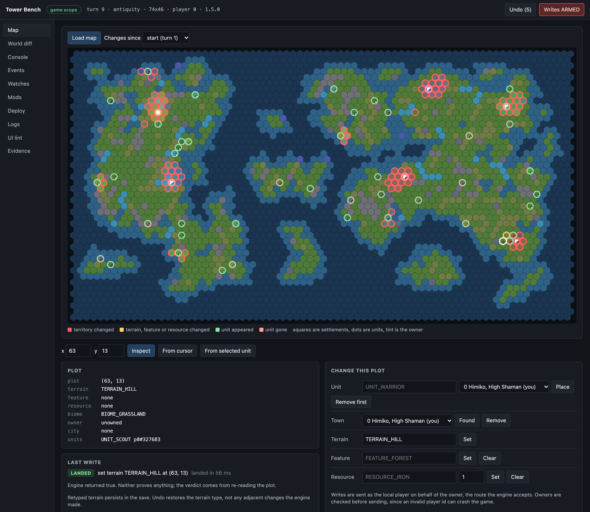

The Map tab: territory gained since turn 1 outlined in red, new units ringed in green, and a terrain write that was
re-read until it `LANDED` in 56 ms.

<table>
<tr>
<td width="50%">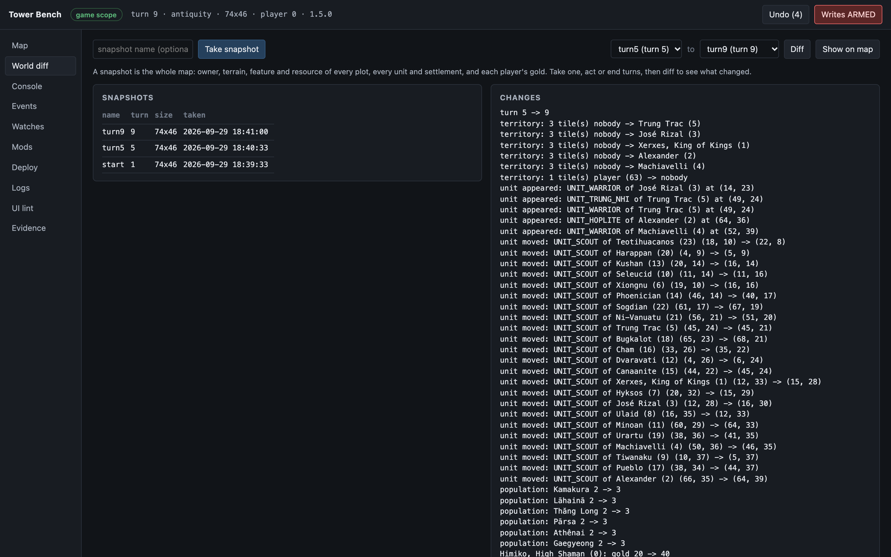<br>World diff: turn 5 to turn 9 in words.</td>
<td width="50%">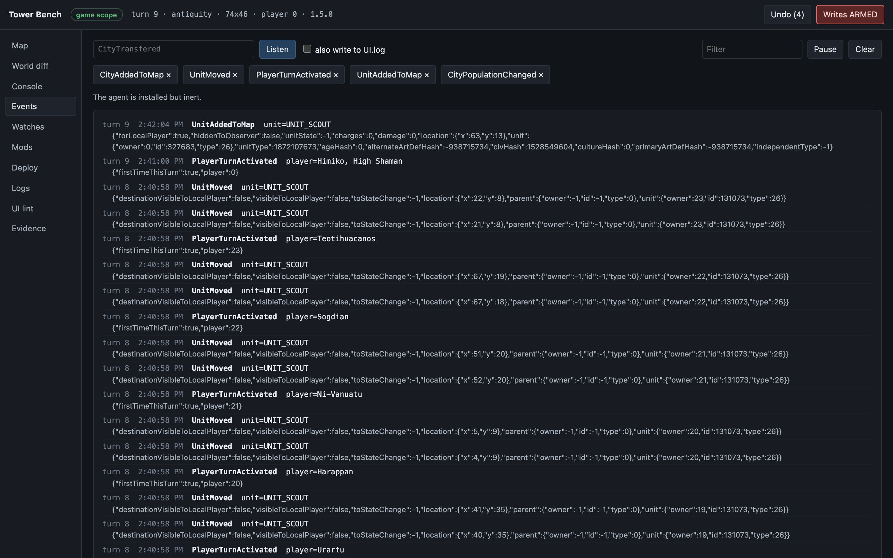<br>Events: the engine's own events, live, with readable names.</td>
</tr>
<tr>
<td>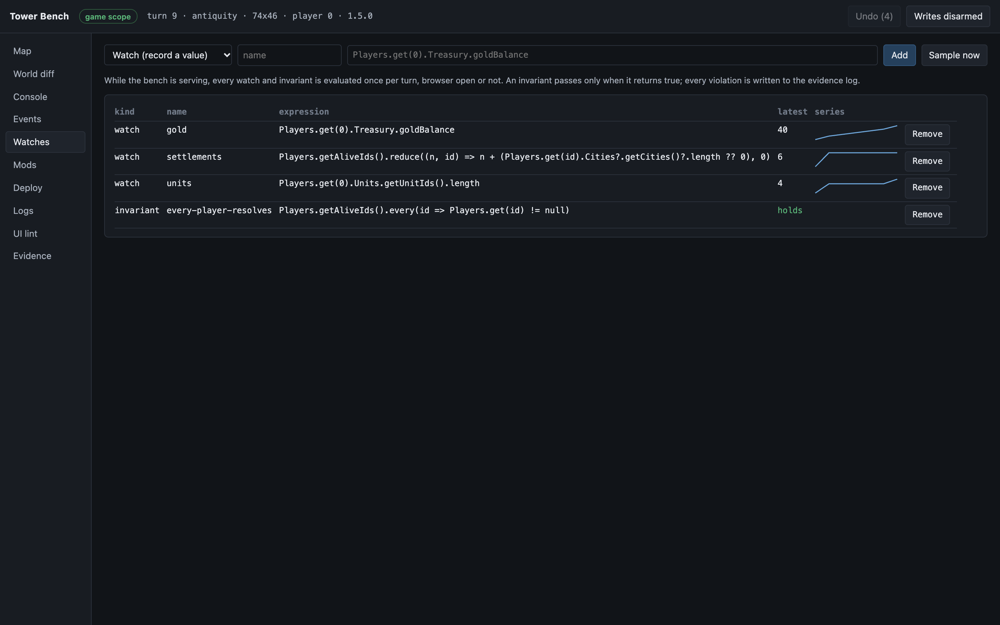<br>Watches sampled once per turn, and an invariant that holds.</td>
<td>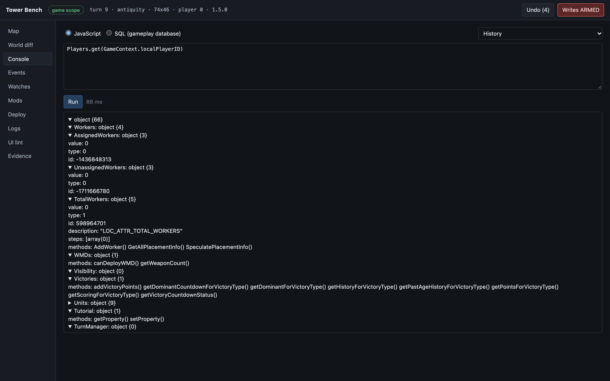<br>Console: an engine object described, methods included.</td>
</tr>
<tr>
<td>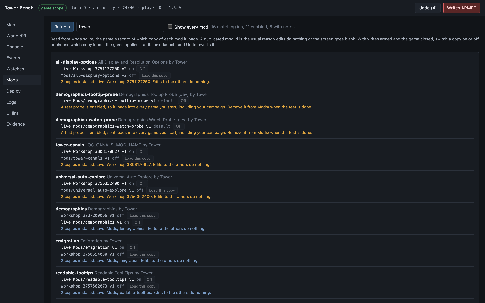<br>Mods: which copy of each mod is live, filtered by author.</td>
<td>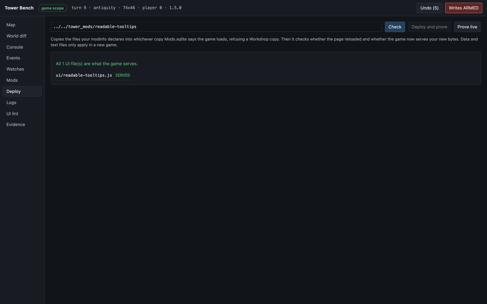<br>Deploy: proof that the game serves your source.</td>
</tr>
<tr>
<td>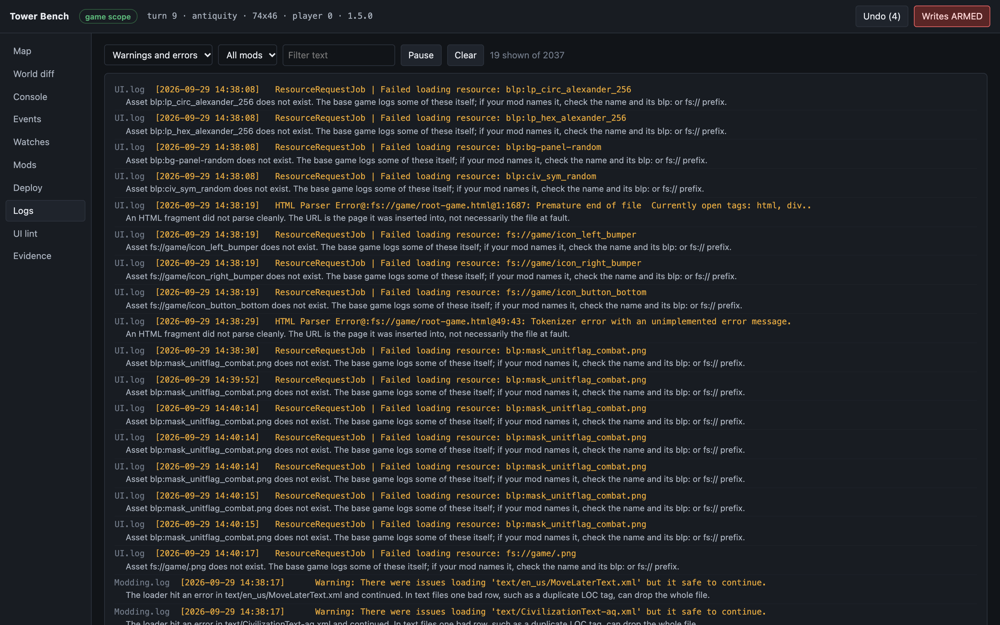<br>Logs: every line classified and explained.</td>
<td>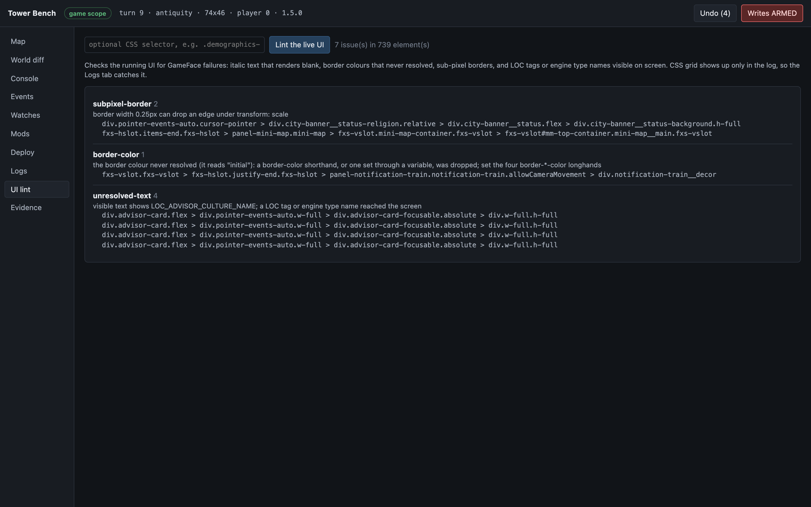<br>UI lint: GameFace failures in the running UI.</td>
</tr>
<tr>
<td>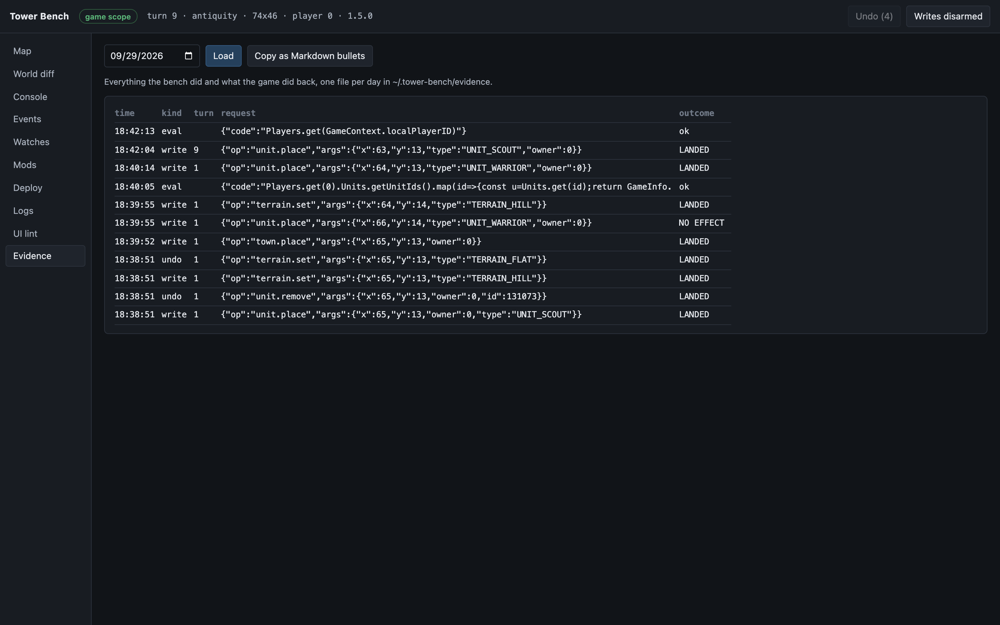<br>Evidence: everything the bench did, and what the game did back.</td>
<td>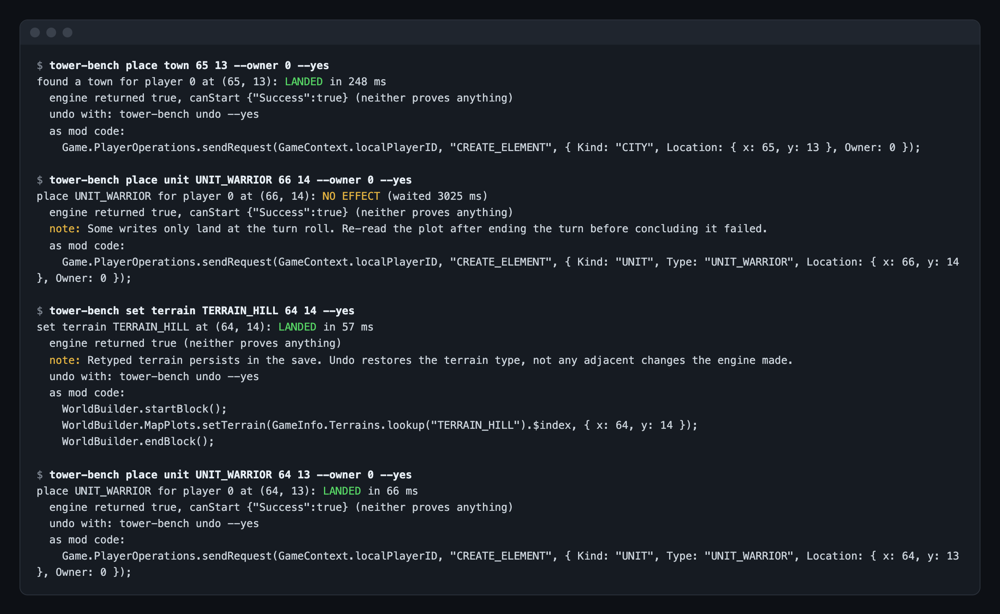<br>The CLI: a unit sent to a coast plot comes back <code>NO EFFECT</code>, although the engine returned <code>true</code>.</td>
</tr>
<tr>
<td>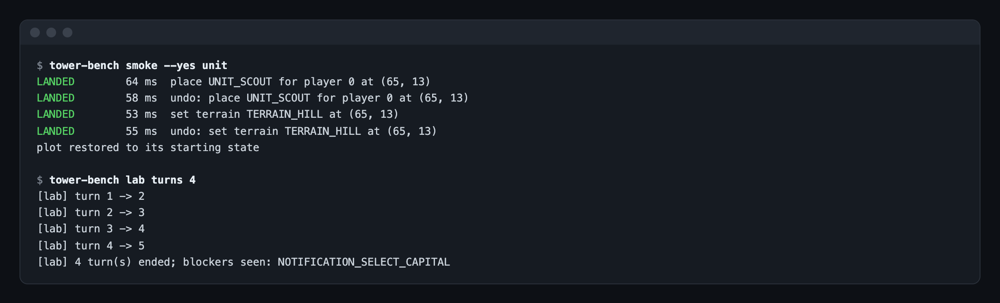<br><code>smoke</code> and <code>lab turns</code>: every write and its undo, then four turns without Autoplay.</td>
<td>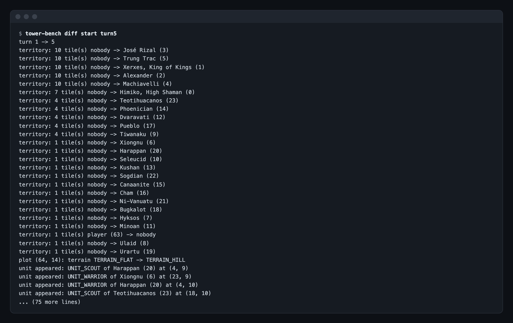<br><code>diff</code>: what four AI turns changed.</td>
</tr>
<tr>
<td>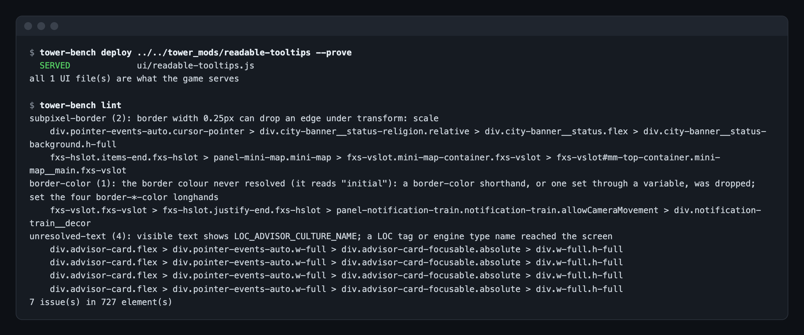<br><code>deploy --prove</code> and <code>lint</code> from the terminal.</td>
<td>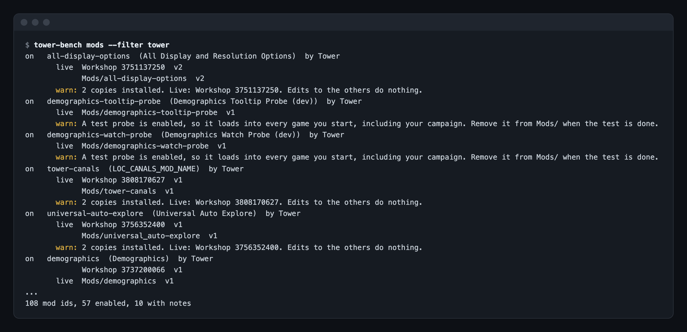<br><code>mods --filter</code>: duplicate copies and enabled probes flagged.</td>
</tr>
</table>

## Requirements

- Node 22 or later.
- The `sqlite3` command-line tool (ships with macOS).
- Civilization VII running with its UI debugger on port 9444. On macOS, game 1.5.0, it answered with `AppOptions.txt`
  left at its defaults; if nothing answers, set `UIDebugger 1` there and relaunch.

## Inspect and change the game

```
node tower-bench.mjs status                         # scope, turn, players, selected unit
node tower-bench.mjs plot selected                  # or: plot cursor, plot unit, plot 12 30
node tower-bench.mjs place unit UNIT_WARRIOR cursor --owner 3 --yes
node tower-bench.mjs set terrain TERRAIN_COAST 40 22 --yes
node tower-bench.mjs undo --yes
node tower-bench.mjs eval 'Players.get(0)'          # objects list their properties and methods
node tower-bench.mjs sql 'SELECT UnitType FROM Units LIMIT 5'
```

**Verified writes.** A write is sent, then the plot is re-read every 50 ms until the intended change appears or the
wait (3 s by default) runs out. The engine's own answers are recorded but never trusted, because `sendRequest` is
fire-and-forget and `canStart` checks request shape, not placement.

| Verdict | Meaning |
| --- | --- |
| `LANDED` | The change was observed, with the time it took |
| `NO EFFECT` | Nothing changed within the wait. Some writes only land at the turn roll |
| `UNEXPECTED` | Something else changed on the plot; the result offers an undo back to the original |
| `ALREADY` | The plot already had that state, so nothing was sent |
| `REFUSED` | Rejected before sending: unknown player, off-map plot, unknown type, nothing to remove |
| `THREW` | The engine call threw |

Supported: place and remove units, found and remove towns, set terrain, set or clear features and resources, for any
player. Requests go out as the local player with `Owner` naming the target civ, the route the engine accepts.

**Undo** reverts today's most recent landed write that has not been undone. The history is the evidence log, so it
survives restarts and the CLI and web UI share it. **Mod code**: each write result carries the minimal standalone call
that does the same thing. **Console**: engine objects serialise to `{}` through JSON, which hides the API, so objects
are described instead, with every method name on their prototype chain. SQL takes one `SELECT` (or `WITH ...
SELECT`) at a time against the live gameplay database; anything that writes is refused before it reaches the game.

## Map and world diff

```
node tower-bench.mjs snap before                    # the whole map in one call
node tower-bench.mjs diff before                    # everything that changed since, in words
node tower-bench.mjs diff before after --json
```

A snapshot holds the owner, terrain, feature and resource of every plot, every unit and settlement, and each player's
gold. A diff groups the changes the way a mod question is asked: tiles moving between players ("2 tiles Augustus (0) ->
Ashurbanipal (1)"), plots retyped, units appearing, dying or moving, settlements founded, lost, captured or growing.
Settlements are matched by plot, so a capture reads as a capture.

The web UI's **Map** tab draws the live map as hexes, tinted by owner, with settlements and units. Click a plot to
inspect and change it. "Changes since" overlays a diff: territory changes, retyped plots, units that appeared and
units that are gone. The row offset and which way north runs are read from the engine, not assumed.

## Deploy, and prove it is live

```
node tower-bench.mjs deploy ~/code/my-mod            # plan: which copy is live, what differs
node tower-bench.mjs deploy ~/code/my-mod --yes      # copy, then prove
node tower-bench.mjs deploy ~/code/my-mod --prove    # copy nothing: does the game serve your source?
```

The target is whichever copy `Mods.sqlite` says the game loads. A deploy into a **Workshop** copy is refused, because
Steam replaces that folder and every other copy is ignored; two enabled copies are refused too. After copying UI files
it calls `UI.reloadUI()` (skip with `--no-reload`), because `UIFileWatcher` does not reload the page for a changed
UIScript. A stamp on the page then shows whether it reloaded, and each UI file the game now serves is hashed and
compared with the source: `SERVED`, `STALE` or `UNREADABLE`. Data and text files are compiled when a game starts, so
they are reported as needing a new game rather than pretended live. A mod with its own deploy script
(`scripts/deploy.mjs`, `install-dev.sh`) should keep using it, since it can ship files the modinfo does not declare;
`--prove` then answers "is my edit live?" on its own.

## Engine events

```
node tower-bench.mjs events list City                 # 269 declared gameplay events, filtered
node tower-bench.mjs events watch CityTransfered UnitMoved --log
node tower-bench.mjs events wait CityTransfered --match "e.names.player === 'Augustus'" --timeout 120
```

The event bridge subscribes with the engine's own `engine.on` inside the page and buffers every event with a page id,
a sequence number, the turn, the raw payload and readable names (`cityID=Nineveh`, `player=Augustus`; player ids are
resolved only through `Players.get`). The bench drains the buffer continuously. When the page is replaced (a reload or
an age transition) the new page id shows it, the bridge re-subscribes, and the break is recorded as an explicit gap
rather than silently missing events. With `--log` every event is also written to `UI.log`, so one recorded just before
a crash survives it; events that arrive both live and from the log are kept once. Everything received is appended to
`~/.tower-bench/events/<local date>.jsonl`.

In a recipe, `{ "events": [...] }` starts listening and `{ "await": { "event", "match", "timeoutMs" } }` waits for a
matching event; `"none": true` instead requires that none arrives, e.g. "no settlement changes hands in five turns".
`match` is a JS expression over the event `e`. This replaces the probe that hooks an event, waits and logs.

**The agent** closes the one gap live reading cannot: code that must run from page load and straight through a reload.
`agent install --yes CityTransfered` writes a small mod, `tower-bench-agent`, whose UIScript is the same bridge code
with the list baked in. It records from the moment the page loads, through every reload and age transition, and always
writes to `UI.log`. The bench picks those lines up and live sessions share its buffer; a live session can add
subscriptions but never remove the agent's. With an empty list (`agent off`) it does nothing, which matters because an
installed mod loads into every game. The game registers it at its next launch; `agent set` changes its list from the
next page load; `agent remove --yes` moves it out of `Mods/`.

The zero-install alternative, CDP's `Page.addScriptToEvaluateOnNewDocument`, is not available: Cohtml's method table
names `navigate` and `reload` from the Page domain but not that method.

## Watches and invariants

```
node tower-bench.mjs watch add gold 'Players.get(0).Treasury.goldBalance'
node tower-bench.mjs watch invariant no-negative-pop 'Players.get(0).Cities.getCities().every(c => c.population > 0)'
node tower-bench.mjs watch sample
```

While `serve` runs, every watch and invariant is evaluated once per turn, browser open or not. Watches become a series
(the web UI draws a sparkline); an invariant passes only when it returns exactly `true`, and every violation is written
to the evidence log with the turn.

## UI lint

```
node tower-bench.mjs lint --scope .my-mod-screen
```

Walks the running UI and flags GameFace failures, judged the way GameFace actually reports them (each watched on
1.5.0, 2026-09-26, by planting the fault in the live UI):

| Rule | What GameFace does | How it is seen |
| --- | --- | --- |
| `italic` | italic text lays out at zero height and draws nothing | computed `font-style: italic` on an element with text; the report includes its collapsed size |
| `border-color` | a dropped `border-color` (a shorthand, or one set through `var()`) reads `initial` | a border with width and style whose colour is `initial` or `currentcolor` |
| `subpixel-border` | a border under 1 px can lose an edge under `transform: scale` | computed width between 0 and 1 px |
| `unresolved-text` | a LOC tag, an engine type name, or a `data-l10n-id` tag that did not resolve, shown as text | visible own text matching the LOC pattern |

CSS grid cannot be checked here: GameFace strips `display: grid` from the style and computes `block`, so only the
log signature (`near text: 1fr`) reveals it, and the Logs view catches that. On an idle map view the whole UI gave 2
hits in 511 elements, both the base game's own; point `--scope` at a mod's root to lint just that mod.

## Mods and logs

`mods` reads `Mods.sqlite` and groups copies by mod id: two enabled copies is an error, a Workshop copy live over a
local one is a warning, a copy inside another mod's `dist/` is a shadow, and an enabled test probe is flagged because it
loads into every game, your campaign included. Names and authors are resolved through each mod's own `LocalizedText`,
and `--filter` (or the box in the Mods tab) matches id, name or author, so `--filter <author>` lists one author's mods.

```
node tower-bench.mjs mods --filter my-mod
node tower-bench.mjs mods live my-mod "Mods/my-mod" --yes              # load this copy, switch the others off
node tower-bench.mjs mods off example-probe --yes
node tower-bench.mjs undo --yes
```

The same changes are buttons in the Mods tab. They change which mods the game loads at its next launch, so they are
refused while the game is running, while a lab run holds a backup of the registry, and while writes are disarmed. Each
change is read back from `Mods.sqlite` (`LANDED`, `NO EFFECT` or `ALREADY`), recorded as evidence and undone by Undo
like a map write. `live` is the fix for two enabled copies of one id; `on` never enables a second copy. A flag the game
left empty (`NULL`, shown as "default") is only replaced when you change that copy, and undo puts `NULL` back rather
than guessing 0 or 1: the game uses it for more than one state. Official content is left to the game's add-ons screen.
A mod folder the game has not registered yet (new, or put back after being moved out) cannot be switched until the game
has launched once: the game registers it enabled at that launch.

`logs` tails `UI.log`, `Modding.log`, `Database.log` and `Scripting.log` and classifies lines against signatures from
real failures:

| Signature | Severity | What it means |
| --- | --- | --- |
| `near text: 1fr`, `display: grid` | error | GameFace has no CSS grid; the stylesheet stopped parsing |
| `does not provide an export named` | error | Usually a stale copy of the mod is loading instead of your edits |
| `No registered handler for 'x (ReplaceUIScript)'` | warn | A Civ VI action verb; the Civ VII loader has none, so the group does nothing |
| `No registered handler for 'x (UpdateText)'` | noise | A valid verb not handled in this scope; official content logs it too |
| `There were issues loading '<file>'` | warn | One bad row, such as a duplicate LOC tag, can drop a whole text file |
| `There were errors loading '<file>' that require a rollback` | error | Names the data or text file that failed |
| `Errors when applying action '<group> (<verb>)'. Rollback Required` | error | Names the action group that failed |
| `Failed to apply enabled components` | error | The game will not start a game that needs this content; it returns to the main menu with a validation error |
| `There was an error applying config actions` | error | A main-menu file failed: no enabled mod's main-menu content loads |
| `Rolling back database`, `complete rollback to vanilla`, `Failed Validation` | noise | Consequences of the failure above, so one failure reads as one incident |
| `Invalid Reference on <Table>.<Column> - "X" does not exist` | error | A row points at a type this game version removed or renamed |
| `Failed loading resource: …chunk.js` | error | An import of a bundle file the game no longer ships; the hint gives the unbundled path rule |
| `SOURCE ERROR - /<mod>/<file>` | error | A module failed to load, so nothing in it runs; attributed to its mod |
| SQLite constraint failures | error | A database action was rejected |
| `Failed loading resource:` | warn | A missing asset; the base game logs some of these itself |
| Uncaught / TypeError / ReferenceError | error | A script threw |

## Conflicts and pre-flight

```
node tower-bench.mjs mods conflicts                      # among the mods the game will load
node tower-bench.mjs mods conflicts --all --level low    # every installed copy, every severity
node tower-bench.mjs check ~/code/my-mod                 # will this mod start a game on this version?
```

Both read files against the installed game and never run anything, so every finding says so. `mods conflicts` reads
the copies `Mods.sqlite` says the game loads and reports where they collide: the same mod id, two different
replacements of one vanilla file, two definitions or ui-next registrations of one component, a definition replacing a
component another mod decorates, two patches of one method, a shared `localStorage` key or global, the same text tag,
and database rows two mods both insert, update or delete. Cooperative merges (`X = Object.assign(X || {}, ...)`) and
chained decorators are not counted as collisions. Each High finding comes with the command that proves it in game
(`registry` for a component, otherwise a `bisect` over the pair) and every finding links to the technique that avoids
it.

`check` is the pre-flight for one mod folder. It reports, with a verdict of `BLOCKS GAME`, `FEATURE DEAD` or `MINOR`:
rows missing a column this version requires, tables or columns that do not exist, duplicates of base-game rows,
modifier effects this version removed, files the modinfo lists but the mod does not ship, imports the game does not
ship, decorations of components that do not exist, text tags that duplicate the base game's, and files loaded at run
time that no modinfo action declares. The cases a naive reading gets wrong are modelled, each watched in a game: a
delete or replace of the base row first (including through `ON DELETE CASCADE`), rows loaded in different ages, groups
gated on another mod, a mismatched XML close tag (the loader repairs it), and a listed `.dds` that is missing. It also
lists the mod's conflicts with the mods the game will load alongside it.

The database checks read the schema from the game's `Debug/gameplay-copy.sqlite`, which the game fills only once a game
has loaded; until then they are skipped and the output says so. `--schema DIR` points at a saved copy of that folder
instead. The Mods tab has a Check conflicts button and the Deploy tab a Pre-flight button.

## AI assistants (MCP)

```
claude mcp add tower-bench -- node /path/to/tower-bench.mjs mcp
claude mcp add tower-bench -- node /path/to/tower-bench.mjs mcp --allow-writes
```

```json
{ "mcpServers": { "tower-bench": { "command": "node", "args": ["/path/to/tower-bench.mjs", "mcp"] } } }
```

`mcp` serves the bench to an AI assistant over the Model Context Protocol on stdio, so Claude Code, Claude Desktop or
any other MCP client can read the game and its files with the same tools you use. It has no dependencies, and clients
that use the initialize handshake are supported.
The assistant can do no more than you could with the CLI, and by default less. Without flags every tool is read-only:
status, plot, the SQL console, snapshots and diffs, events, logs, mods and conflicts, check, doctor, crash triage,
game impact, database diffs, the registry view, lint, techniques and the evidence log. Tools that change
something (map writes, game-state actions, undo, deploy, mod switches, recipes, lab turns and lab stop) are listed but
refused until you start the server with `--allow-writes`, and the bench is armed for that one call only. `lab_start` and
`bisect` also need `--allow-lab`. The JavaScript console is not listed without `--allow-eval`, and a recipe whose steps
run code needs it too. `lab_turns` keeps the lab's own refusal: it never ends turns in a game the lab did not start.
Every call, refused or not, is recorded in the evidence log as kind `mcp`.
Tool descriptions tell the assistant what a verdict means (LANDED is the change read back from the game; the engine's
own return value proves nothing) and that a static finding is a hypothesis to prove in a lab game before acting on it.
The techniques library and the evidence log are also offered as MCP resources. stdout carries protocol messages only.
Tested by exchanging JSON-RPC with the server over stdio and against real files read-only; not yet watched driving a
running game.

## Nightly regression runs

```
node tower-bench.mjs nightly init
node tower-bench.mjs nightly run --only-if-updated
node tower-bench.mjs nightly schedule --at 03:00 --yes
```

A game update is the moment most likely to break every mod at once, so the bench can check your mods overnight and leave
a report for the morning. `nightly init` writes a suite listing your enabled local mods, each with a recipe that starts
a seeded game and ends one turn; add your own recipes to it. `nightly run` notices a new game version, indexes it
(refreshing the Debug database with one lab game when it predates the install), compares it with the previous index and
lists what the update breaks in each mod. It then runs each mod's pre-flight and localization checks and each recipe in
a seeded lab game that restores saves, settings and the registry afterwards, reads the logs for errors the mod caused,
and triages any crash. Each mod is reported PASS, FAIL or BROKE-BY-UPDATE with its evidence, together with what newly
fails or was fixed since the last report, as JSON, Markdown and HTML.

`--only-if-updated` does nothing until the version changes. A run refuses to start while the game is running, while
another lab, bisect or nightly run is active, or when a save was written in the last 30 minutes, and it checks again
before every game, so someone starting to play stops the rest of the night. `nightly schedule` installs a per-user
launchd agent on macOS (on Windows and Linux it prints the schtasks or cron line to add yourself); `nightly unschedule
--yes` removes it. The orchestration, reports and schedule generation are tested; the lab games and the scheduled launch
have not been watched end to end.

## Doctor: "my mod does not work"

```
node tower-bench.mjs doctor ~/code/my-mod
node tower-bench.mjs doctor ~/code/my-mod --all --offline
```

`doctor` checks the usual causes in the order they are cheapest to rule out, and stops at the first one with the next
action to take. Did the game update since the newest game index (the first launch after an update loads no mods)? Which
copy of the mod id does the game load: a second enabled copy, a Workshop subscription or a nested build folder can
shadow the one you edit. Does the pre-flight find a defect that stops a game or kills a feature? Is the edit live: the
copy on disk against your source and, with the game connected, the bytes the game serves. What do the recent logs say
about the mod, errors first, a database rollback read as one incident. With the game connected: did this game apply the
mod, and did its components win. Finally, its conflicts with the mods loaded alongside it.

Each step says OK, PROBLEM or SKIPPED and why. `--all` runs every step, `--offline` never asks the game, `--json` gives
everything; the Doctor tab does the same. The steps that need the game are built against fakes and have not been watched
in a live game yet.

## Crash triage

```
node tower-bench.mjs crash
node tower-bench.mjs crash list
```

`crash` reads the newest crash report (or one you name) before any theory: the time, the exception, the faulting thread
and its top frames as offsets into each image, and a signature from the game binary's own frames, so a repeat of the
same crash on the same build is counted. It gathers what the dying run left: the end of `UI.log`, the bench's
breadcrumbs, the mods the run applied, the last rows of the AI logs, renderer errors, and the enabled mod set. The game
truncates its logs at the next launch, so when the logs started after the crash, `crash` says they belong to a later run
and leaves them out. A native crash is isolated by switching mods on and off, so the last line is the exact `bisect`
command. Reports are read from macOS's DiagnosticReports and from the copies lab runs keep; other platforms are not
supported yet.

## Game updates

```
node tower-bench.mjs game snapshot
node tower-bench.mjs game diff
node tower-bench.mjs game impact
```

When the game updates, the bench can tell you which mods the update breaks before you find out one crash at a time.
`game snapshot` indexes the installed game: every module file with its hash, what each script exports, the component
names it defines, and the compiled database schema from the Debug copy (load a game once first; a copy older than the
install is refused, and tables that installed mods create are left out). The index is self-contained, because an update
deletes the old files: snapshot before an update and again after it.

`game diff` lists what changed: files moved, renamed or removed, exports that went away, components, tables and columns,
columns that became required, and modifier effect types that were removed. `game impact` reads your enabled mods (or
`--mods all`, or any folders) and reports what each relied on that changed, with the old and new fact and a suggested
fix, such as the moved file's new path. These findings are read from files; prove one in a game before acting on it.
`doctor` and the Game updates tab say when the installed version is newer than your newest index.

## Database diff and conflict proofs

```
node tower-bench.mjs dbdiff my-mod --yes
node tower-bench.mjs dbdiff --files a.sqlite b.sqlite
node tower-bench.mjs mods conflicts --prove --yes
```

`dbdiff <mod-id>` answers what a mod actually changed in the game's compiled database. It starts two seeded test games
through the lab, the mod off and then on, copies each game's Debug databases (gameplay, localization, frontend) and
compares them table by table: rows added, removed and changed, matched by primary key (or as whole rows where a table
has none, or where a key with NULL parts repeats), with the changed columns and their old and new values for the first
rows. Your saves, settings and registry are restored after each game. `--files` runs the same comparison on any two
SQLite files, read-only; a 28 MB gameplay database takes about half a second.

`mods conflicts --prove` runs a test game for each pair of mods behind a High finding (Medium too with `--level medium`)
with only that pair enabled. Component collisions are judged from the running game's registry, database and text
collisions from the load logs (a rollback confirms one; a clean load refutes a duplicate key but leaves an update or
text collision to `dbdiff`), duplicate ids from the registry and the last launch's log. Findings that need a symptom to
show get the bisect command instead. Each verdict is evidence and is stored, so later `mods conflicts` runs show
"confirmed on <date>" next to the finding. The game-driven parts are tested against a simulated lab and have not been
watched yet.

## Game-state actions

```
node tower-bench.mjs do list
node tower-bench.mjs do gold 500 --yes
node tower-bench.mjs do heal --unit selected --yes
```

`do <action>` and the Actions tab change the running game for testing: Gold, Influence, the celebration meter, Science
and Culture, wildcard attribute points; heal, damage, experience, promotion, movement, move and kill a unit; production
progress, completion and population for a city; completing research or a chosen tech or civic; revealing the map and
giving a plot to a city. Each is a write like any other: refused while writes are disarmed, sent as the local player
naming the target, re-read until the change is seen, logged with a verdict and the standalone call a mod would use. Food
and Production grants, and negative Science or Culture, are not offered, because the engine was watched doing nothing
with them.

Undo reverses only what the engine has been seen to reverse (Gold, Influence and the celebration meter by the opposite
grant, unit damage, a killed unit by placing a new one, production progress, a plot taken from another city). When the
newest change cannot be undone, Undo refuses rather than reverting an older one; `undo --skip` (or confirming in the
page) reverts the one before it. The engine behaviour behind the grants, production, population, plot purchase and
reveal, and unit removal was watched on 1.5.0; none of the actions has been watched through the bench yet.

## Cost

```
node tower-bench.mjs cost my-mod --yes --turns 20
```

`cost <mod-id>` measures what a mod costs per turn: seeded test games with the mod off and on, alternating the order,
every other enabled mod left as it is, turns ended without Autoplay. Per turn it records the wall time from turn end to
the next local turn start, the page's JS heap, the game's resident memory, CDP metrics where the debugger answers, and
new error lines. The report gives the median and 90th percentile per arm, the difference, a noise estimate and a
verdict. The statistics are tested; the measurement has not been watched against the running game.

## Before a release: release-check and l10n

```
node tower-bench.mjs release-check ~/code/my-mod/dist --zip my-mod.zip --against my-mod-1.2.0.zip
node tower-bench.mjs l10n ~/code/my-mod
node tower-bench.mjs l10n live
```

`release-check` reads the package you are about to ship and reports each check as PASS, FAIL, WARN or INFO with its fix:
the version is higher than the last release (the `--against` package, else the Workshop copy registered in Mods.sqlite),
the changelog has an entry for it, the zip matches the folder, every file the modinfo lists ships and nothing loaded at
run time is undeclared, no development leftovers or nested copy of the mod, nothing outside the mod folder, no probes or
debug switches left on, the pre-flight finds nothing that blocks a game, the name and description resolve,
AffectsSavedGames is set deliberately, and a Steam .vdf beside the package uploads this mod at this version. It exits 1
on any FAIL, so a release script can stop on it. Zips are read with unzip (macOS, Linux) or tar.exe (Windows 10 and
later).

`l10n` lints localization: LOC tags used but not defined in English (in the mod or the base game), each shipped language
against English, duplicate tags, language codes the game does not have and locale attributes that disagree with their
rows, placeholders a translation uses differently, and font lists that cannot draw Chinese, Japanese or Korean text when
the mod ships it. `l10n live`, and two rules in `lint`, walk the running UI for visible text that draws as boxes; that
walk has not been watched in a game.

## What won: the registry view

```
node tower-bench.mjs registry
```

Mods collide in ways a file listing cannot settle: two mods define the same component, one registers a ui-next screen
over another, a mod switched off for the next launch is still in the game you are playing. `registry` reads the
outcome from the running game, on the main menu or in a game:

- legacy components (`Controls.define`) a mod replaced or styled, with their priority and class;
- ui-next components (`ComponentRegistry`) registered above the base priority of 0, with the factory that won. The
  registry keeps only the winner, so the losers come from the static conflict check;
- the mods this game applied (`Modding.getActiveMods()`) against the ones `Mods.sqlite` enables for the next launch,
  with the ordinary reasons the two differ.

Each source is probed before it is read; one this game version does not expose is reported as unavailable. The
Registry tab shows the same.

## Canvas resource pool

```
node tower-bench.mjs canvas probe --k 1000
node tower-bench.mjs canvas count install
node tower-bench.mjs agent canvas on
node tower-bench.mjs canvas stress --yes --reload-at 30000      # lab games only
```

Painting on a `<canvas>` is reported to take a slot in a 49,152-item renderer pool per `fill()` or `stroke()`, never
released, with a hard crash when it fills (`PartitionedResourceList.AddStaticResource()` in `Renderer.log`). `canvas
probe` looks for a readable counter: it samples every resource-like number the game's script objects and debugger
domains expose, waits without painting as a control, paints `k` calls, and samples again. A counter moves by about
one per call and not during the control. Without one, `canvas count` wraps the 2D context's paint methods and counts
calls on the current page, an upper bound on slots; `agent canvas on` does the same from page load and writes a
`[TB-CANVAS]` line to `UI.log` every 1,000 calls. A watch on `globalThis.__tbCanvas?.calls` turns it into a series per
turn. `canvas stress` paints until the game dies and reports the count it died at from the last breadcrumb in
`UI.log`; with `--reload-at` it reloads the page once on the way, which shows whether the pool lives as long as the
page or the process. It refuses to run outside a lab game.

## Techniques

```
node tower-bench.mjs techniques persist
node tower-bench.mjs techniques show decorate-dont-replace
```

A library of techniques used successfully in Civilization VII mods, each with what it is for, why it works, when to
use it and when not, a short snippet, pitfalls, and whether it still works on the current game. Patterns to avoid are
listed with the reason. The Techniques tab browses and searches it. Findings elsewhere link to it: a log line, a lint
hit, a mod-copy warning, a refused deploy, a conflict or a pre-flight defect carries "How to do this instead" links to
the entries that fix it, and the console offers the entries that use the engine objects your code names.

A recipe can list the techniques it exercises (`"techniques": ["lens-registration"]`). When it passes in a lab game,
those entries are marked watched by the bench with the date and game version; a later failure shows as the latest
run.

## Test games, recipes and bisection

```
node tower-bench.mjs lab start --seed 4242 --age AGE_ANTIQUITY
node tower-bench.mjs lab turns 5
node tower-bench.mjs lab stop
node tower-bench.mjs lab run my-test.json            # seeded game -> recipe -> restore
node tower-bench.mjs recipe record > my-test.json     # today's landed writes as a recipe
node tower-bench.mjs bisect --turns 30 --replicates 2
```

**The lab** backs up `Mods.sqlite`, `LocalStorage.sqlite`, `HallofFame.sqlite`, every `*Options*.txt` and
`Saves/Single/auto`, then starts a Play Now game entirely over CDP from the main menu: no probe mod, no registry
change. Seeded Play Now games are deterministic. `lab turns` ends turns without Autoplay (Autoplay spends the
treasury) and refuses to run in any game the lab did not start. `lab stop` quits the game and restores every backed-up
file and every registry flag by path; whatever the test game wrote is moved into the run folder, never deleted. Before
starting it refuses if the game or another lab or bisect run is running, and warns about enabled probe mods. Set
`TOWER_BENCH_HARNESS` to a regular expression matching your own test scripts to have them block a start too.
`lab stop` only quits the game the lab started; any other running game is refused, not killed.

**A recipe** is a test written as JSON: a seed and start age, then steps (`snapshot`, `write`, `turns`, `diff`,
`expect`, `eval`, `lint`, `sample`, `events`, `await`). Positions can anchor to the local player's first unit with an
offset, so one recipe works on any seed. `recipe record` turns the writes you landed by hand today into a recipe,
skipping any you undid. A recipe is code, like a test file: `expect` and `eval` run in the game and `await` matches run
in Node with your user's rights, so run recipes you wrote or have read.

```json
{ "name": "strand-check", "seed": 4242, "age": "AGE_ANTIQUITY",
  "steps": [ { "snapshot": "start" },
             { "write": { "op": "unit.place", "args": { "at": "unit", "dx": 1, "type": "UNIT_SPEARMAN", "owner": 1 } } },
             { "turns": 2 },
             { "diff": "start" },
             { "expect": "Players.get(1).Units.getUnitIds().length > 0" } ] }
```

**Bisection** answers "which mod does this need?" by isolation. It runs the failure with every candidate on (it must
fail) and every candidate off (it must pass), then halves the set until one mod remains, and confirms that everything
else without it is clean. A failure is a crash (the game exits, a new `.ips` appears) or a failed recipe. Crashes here
are not fully deterministic, so each configuration runs `--replicates` times: it fails if any replicate fails and is
clean only if all are. Verdicts: `ISOLATED`, `INTERACTION` (needs mods from both halves), `NOT REPRODUCED`,
`NOT A CANDIDATE` (fails with every candidate off), `INCONCLUSIVE`. Each trial is a full lab cycle, so the registry and
your files are restored after every game.

## Safety

- Map writes (place, remove, set, undo) and mod switches are disarmed until armed in the UI or confirmed with `--yes` on
  the CLI. The console, watches and deploy are not gated by arming: the console runs whatever JavaScript you give it in
  the game, and deploy copies files and reloads the game's UI. The SQL console refuses anything but a single read.
- Every player id is resolved through `Players.get` before a request is sent: an invalid id passed to some engine
  calls segfaults the game.
- The server binds to `127.0.0.1` only, refuses any other `Host` header, refuses a `POST` without an
  `X-Tower-Bench: 1` header, and refuses any request a browser marks as cross-site, so a web page open in your
  browser cannot drive or load the game through it. It serves only its own page and scripts.
- `deploy` refuses a modinfo that lists a file outside the mod folder, and the bench only connects to a debugger
  socket on this machine.
- The debugger port itself is the game's, not this tool's. While the game runs with it open, anything on the machine
  can reach it.

## Configuration

| Variable | Default (macOS) |
| --- | --- |
| `TOWER_BENCH_USER_DIR` | `~/Library/Application Support/Civilization VII` |
| `TOWER_BENCH_INSTALL` | the Steam app bundle, used for the build version |
| `TOWER_BENCH_CDP_PORT` | `9444` |
| `TOWER_BENCH_EVIDENCE_DIR` | `~/.tower-bench/evidence`; snapshots, watches and lab runs live beside it |
| `TOWER_BENCH_HARNESS` | unset; a regular expression for your own test scripts, which then block `lab start` and `bisect` |

On Windows the user directory defaults to `%LOCALAPPDATA%\Firaxis Games\Sid Meier's Civilization VII`.

## Verified, and how far

**Watched working, 2026-09-26, game 1.5.0:**

- 70 tests at the time, stable across 15 consecutive runs (78 now, with the security tests). They cover the in-game
  functions run against a fake engine: the write verification loop reaching each verdict, the snapshot reading row shift
  and north from the engine, watches and invariants, and the page-side hash matching the Node-side one. The event bridge
  is tested end to end through the real page-side function: subscribe, fire, drain, readable names, unsubscribe via
  `engine.off`, buffer overflow counted as dropped, a simulated reload caught as a gap, de-duplication against `UI.log`
  including a clipped line, `waitFor` and `none`, recipe `await` steps, and the agent script loading on its own and
  keeping its list and logging when a live session unsubscribes. Two deliberate breaks of the bridge (pinning, page
  identity) each turned a test red. They also cover world diffs, recipe execution and recording, the bisection search
  (culprit, interaction, flaky failures, both "no" answers), deploy planning and its refusals, watch series, lab restore
  (files back byte for byte, `NULL` kept as `NULL`, nothing deleted, new registry rows left alone), log signatures
  against lines from real game logs, and every CLI command run as a subprocess.
- Against real data: `mods` found 107 ids, 71 enabled, 7 duplicated ids and 3 enabled test probes. `logs` classified
  1,326 lines. `deploy` refused `universal-auto-explore` because its Workshop copy is live, and planned Demographics
  correctly: its live copy dates from 09-24 and differs from the 09-26 source.
- In headless Chrome: all nine tabs with zero console errors or exceptions. The lint rules flagged all six traps in a
  fixture page and none of its decoys. The map drew a synthetic 96x60 world with a diff overlay, and a click on a plot's
  pixel centre mapped back to that plot. The server refused a foreign `Host`, a headerless `POST` and a disarmed write.

**Watched live, 2026-09-26, game 1.5.0, a seeded lab game (seed 4242) started by `lab start`:**

- `lab start` backed up and started the Play Now game hands-free over CDP; `lab turns` ended five turns without
  Autoplay, passing the `COMMAND_UNITS` blocker; `status` read the game. `lab stop` then quit it and restored the
  player's files: all 11 autosaves, `LocalStorage.sqlite`, `HallofFame.sqlite` and 9 options files byte-identical to
  the backup, 114 registry rows unchanged (the only new row was `tower-bench-agent`), and the test game's 7 autosaves
  and file copies set aside in the run folder, not deleted.
- Writes: unit place and undo, terrain FLAT -> HILL and undo all `LANDED` in 82 to 156 ms, each confirmed by re-read.
  A forest requested on a desert plot cleared the plot's sagebrush instead; that run exposed that `NO EFFECT` was
  hiding a real change, and the `UNEXPECTED` verdict (with an undo back to the original) was added for it.
- Events: `events wait` caught `PlayerTurnActivated` live; `events watch` streamed only the requested event, with
  readable names including Unicode city names. `UnitMoved` arrives for units the local player cannot see.
- The agent registered at launch, attached at page load, recorded 72 events with no sequence gaps, kept its pinned
  list while live sessions subscribed and unsubscribed, and after `UI.reloadUI()` wrote its unload marker and
  re-attached on the new page within 1 s, recording 63 more. The live watcher reported the reload as a gap.
- `Page.reload` over CDP and `UIFileWatcher` did not reload the page; `UI.reloadUI()` did.
- `bisect` with `recipes/bisect-selftest.json` (fails only when Emigration is loaded) over four mods returned
  `ISOLATED: emigration` in the five games predicted, each 30 to 40 s: all on failed, none on was clean, the half with
  Emigration failed, Emigration alone failed, everything but Emigration was clean. The last game's `Modding.log`
  applied Demographics, Cultural Diffusion and Readable Tooltips and never named Emigration. After all five, the
  player's autosaves, LocalStorage, Hall of Fame and options were byte-identical to before the first game, all 115
  registry rows unchanged, and no crash reports.

- Snapshots and diff: two known writes between snapshots diffed to exactly those two changes and nothing else, and
  undoing both diffed back to nothing. Across two AI turns the diff agreed with the agent's recorded events: every
  settlement founded matched a `CityAddedToMap`, every unit that moved was accounted for. That check caught the bench
  counting each city 7 times (`MapCities.getCity` answers for every owned plot);
  fixed, and `remove town` on a territory plot now refuses instead of destroying the city.
- The map drew the real 74x46 world with the engine's layout (odd rows shifted, north at y+1) and a diff overlay.
- Lint: all four rules above flagged a planted fault in the live UI after three were corrected to GameFace's actual
  behaviour; hidden elements and plain captions were not flagged.
- Watches: `serve` sampled once per turn across a two-turn roll; an always-true invariant held and an always-false
  one wrote exactly one `VIOLATED` evidence entry per turn.
- Deploy: `--prove` on Demographics found 150 files served identical to source and 60 stale, the 60 being exactly
  the UI files that differ on disk (read over XHR; GameFace has no `fetch`). A real deploy copied a changed file,
  reloaded the UI itself, served the new bytes, and the new code's marker was live in the page on the same turn.

**Watched live again, 2026-09-29, game 1.5.0, after the 0.1.0 restructure:** the lab started a seeded game hands-free
with a chosen set of mods, and `Modding.log` listed exactly those mods as applied, so registry flags written the way the
Mods tab writes them take effect at launch. `smoke` landed a unit placement, a terrain change and both undos in 53 to 66
ms and left the plot as it was. A town, a unit and a terrain change landed; a land unit sent to a coast plot came back
`NO EFFECT` while the engine returned `true`. `lab turns` rolled eight turns without Autoplay. Snapshots and diffs,
watches sampled per turn, the event stream, the console, deploy `--prove`, lint, logs and the Mods tab all ran on that
game; the screenshots above are that session. `lab stop` quit only its own game, and afterwards all 114 registry rows
and the player's autosaves, LocalStorage, Hall of Fame and options files matched the backup exactly.

**A Mods-tab switch, watched end to end on the real registry, 2026-09-29:** the Off button on one copy of a mod
`LANDED`; at the game's next launch (started by another test harness on the same machine) `Modding.log` applied every
enabled mod except that one; the Undo button then put the flag back, and all 113 registry rows matched a snapshot taken
before the switch.

**Not watched yet (0.2.0 work, built and tested offline only):** the registry view, the canvas probe, counter and
stress test, and the agent's canvas counting have run only against fake engines in the tests; none has run in a game.
`mods conflicts` and `check` ran on a real install (22 enabled mods, 2.6 s) and, over a corpus of 1,249 published
mods, flagged every statically detectable defect that had been watched blocking a game or killing a feature (17) and
none of the 4 watched false flags. Their predictions are not watched; each finding says so. The web UI's Techniques,
Registry, conflicts and pre-flight views were driven in headless Chrome with no console errors.

**Built and checked offline for the next release, not watched in game:** `dbdiff --files` on real database copies
(a file against itself shows no change; two copies from different mod sets in about half a second); `game snapshot`
of 1.5.0 (11,119 files, 488 KB) and `game impact` over the enabled mods, plus a reconstructed 1.4.2 index over 1,247
published mods whose flags matched the defects found by the earlier analysis (partly circular: the reconstruction
came from that analysis); `crash` over 14 real crash reports (4 signatures); `doctor`,
`release-check` and `l10n` on real mod folders and packages. Every tab was driven in headless Chrome with no console
errors and the bench pointed away from any game. The game-state actions, `cost`, the lab halves of `dbdiff` and
`mods conflicts --prove`, the connected `doctor` steps and `l10n live` ran only against fakes.

**NOT verified yet:** the `lab run` command as a whole (its parts ran inside bisect), the Windows default paths, and the
hint for a land unit sent to water as shown in a live write (its inputs, `GameplayMap.isWater` and the unit's `Domain`,
are what the base game's own scripts use).


## Engine behaviour this relies on

Each of these was watched in the game before the bench relied on it: writes land after the call and the return value
proves nothing; an operation sent under another player's id is refused; `CREATE_ELEMENT {Kind: "CITY"}` silently
rejects some founding spots; `WorldBuilder.MapPlots.setTerrain` lands about a tick later and does not rebuild the
navigation graph for a navigable river. The lab relies on these, also watched: Play Now honours the mod registry where
a loaded save does not, nothing gameplay-side lands before `UI.notifyUIReady()`, Autoplay spends the treasury, the
registry is restored by path because row ids change on re-scan, and a crash report lands 20 to 50 s after the game
dies. The `DESTROY_ELEMENT` argument shapes follow the SDK's own `tuner-input.ts`.

## Contributing

`npm install` once, then `npm run verify` before a change: type check, lint and tests, with zero errors. The bench
itself has no runtime dependencies; the installed packages are the checkers only.

## License

MIT. See [LICENSE](LICENSE). Tower Bench is not affiliated with or endorsed by Firaxis Games or 2K. Civilization is
a trademark of Take-Two Interactive Software.
